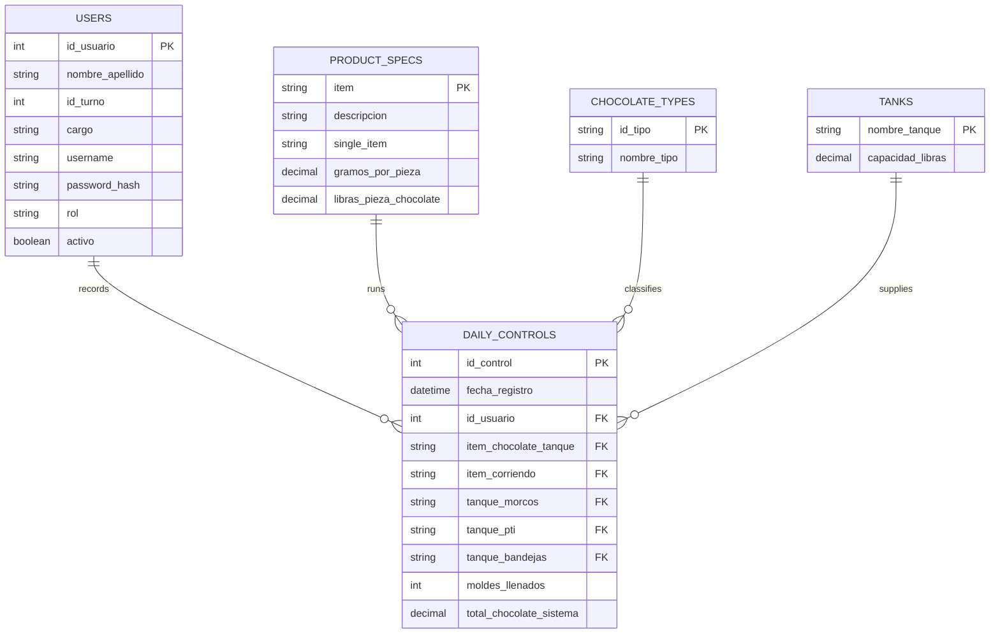

# 1. Chocolates App

## 1.1 Table of Contents

- [1. Chocolates App](#1-chocolates-app)
  - [1.1 Table of Contents](#11-table-of-contents)
  - [1.2 Configuration](#12-configuration)
  - [1.3 Running](#13-running)
  - [1.4 Database Schema](#14-database-schema)
  - [1.5 Business Logic](#15-business-logic)
  - [1.6 Documentation](#16-documentation)

## 1.2 Configuration

Backend `.env`:

```text
DB_HOST=
DB_USER=
DB_PASSWORD=
DB_NAME=chocolates
DB_PORT=3306
APP_PORT=3000
AUTH_SECRET=replace-with-a-long-random-secret
```

Frontend optional `.env`:

```text
VITE_API_BASE_URL=http://localhost:3000/api
```

## 1.3 Running

Install dependencies:

```bash
cd backend
npm install

cd ../frontend
npm install
```

Start each app:

```bash
cd backend
npm run dev

cd ../frontend
npm run dev
```

## 1.4 Database Schema



`DAILY_CONTROLS` maps to `controles_diarios`. In SQL, it has three tank foreign keys: `tanque_morcos`, `tanque_pti`, and `tanque_bandejas`, all pointing to `tanques.nombre_tanque`.

The database is split into `schema.sql`, `seed.sql`, and `users.sql`. It also defines `vista_balance_chocolate`, a view used to calculate daily chocolate balance totals.

Docker keeps MySQL data in the `mysql_data` volume. `docker compose down` stops the database without deleting that data; `docker compose down -v` deletes the volume and resets the database. If an old database is missing auth columns on `usuarios`, run `backend/src/database/migrations/001_add_auth_columns_to_usuarios.sql`.

## 1.5 Business Logic

A. The daily report starts from one operator, one shift, one chocolate type, one running product, and the measured production inputs from the Excel sheet.

B. Product specs provide the per-piece chocolate weight, units per mold, and pieces on belt. These values drive mold, belt, and finished-process pound calculations.

C. Tank-related calculations use the `tanques` catalog. Morcos, PTI, and tray capacities are linked from `controles_diarios` through foreign keys instead of hardcoded as loose values.

D. `total_chocolate_sistema` is stored from the system report, like the Excel summary. The backend view compares it against calculated physical chocolate to return add/remove adjustments.

## 1.6 Documentation

| File | Purpose |
| --- | --- |
| [backend/docs/API.md](backend/docs/API.md) | Endpoint reference. |
| [backend/docs/ARQUITECTURE.md](backend/docs/ARQUITECTURE.md) | System architecture. |
| [SECURITY.md](SECURITY.md) | Security notes. |
