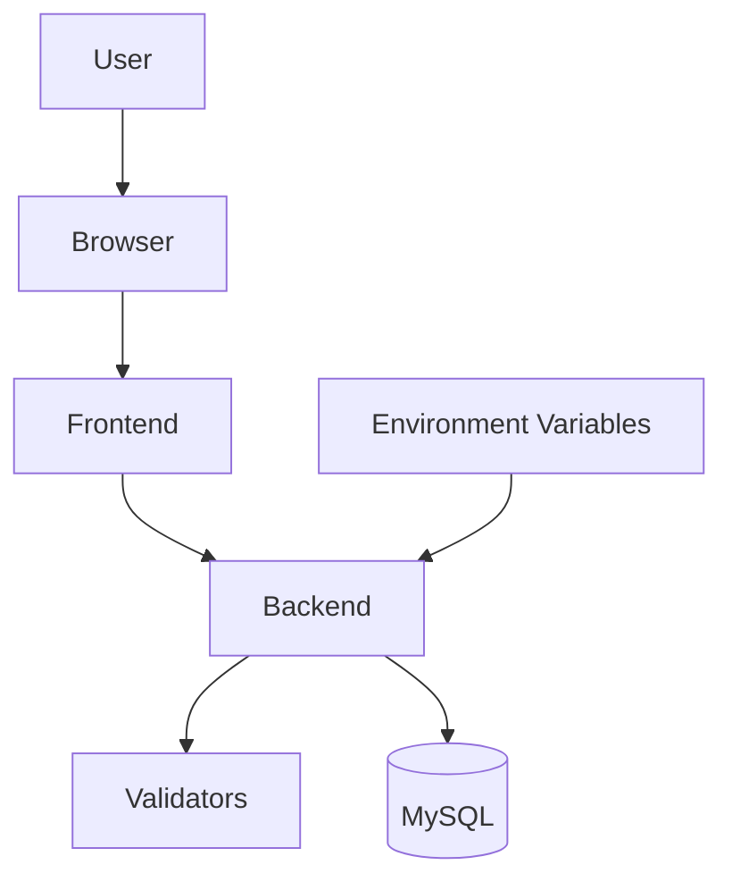

# 1. Security

## 1.1 Table of Contents

- [1. Security](#1-security)
  - [1.1 Table of Contents](#11-table-of-contents)
  - [1.2 Scope](#12-scope)
  - [1.3 Security Model](#13-security-model)
  - [1.4 Secrets](#14-secrets)
  - [1.5 Database](#15-database)
  - [1.6 API Validation](#16-api-validation)
  - [1.7 Dependency Checks](#17-dependency-checks)

## 1.2 Scope

This document covers basic security notes for the React frontend, Express backend, and MySQL database.

## 1.3 Security Model



## 1.4 Secrets

Do not commit real credentials. Keep database secrets in local environment files or deployment secrets.

Sensitive values:

| Variable | Purpose |
| --- | --- |
| `DB_USER` | Database username. |
| `DB_PASSWORD` | Database password. |
| `DB_HOST` | Database host. |
| `DB_NAME` | Database name. |
| `AUTH_SECRET` | Token signing secret. |

Seeded users use a default development password. Change those passwords before using the system outside local development.

## 1.5 Database

Use a dedicated application database user with minimum required permissions. Avoid using root credentials from the app.

The models use parameterized SQL placeholders, which helps reduce SQL injection risk.

## 1.6 API Validation

Write endpoints should validate required fields and expected types before reaching the model layer. The daily controls creation flow already validates critical fields.

Recommended additions before production:

| Control | Purpose |
| --- | --- |
| Authentication | Restrict who can use the system. |
| Rate limiting | Reduce abuse on public deployments. |
| Safer error messages | Avoid leaking internal details. |

## 1.7 Dependency Checks

Run dependency audits periodically:

```bash
cd backend
npm audit

cd ../frontend
npm audit
```
