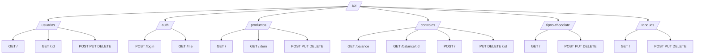

# 1. API

## 1.1 Table of Contents

- [1. API](#1-api)
  - [1.1 Table of Contents](#11-table-of-contents)
  - [1.2 Base URL](#12-base-url)
  - [1.3 Response Format](#13-response-format)
  - [1.4 Route Diagram](#14-route-diagram)
  - [1.5 Authentication](#15-authentication)
  - [1.6 Users](#16-users)
  - [1.7 Products](#17-products)
  - [1.8 Controls](#18-controls)
  - [1.9 Chocolate Types](#19-chocolate-types)
  - [1.10 Tanks](#110-tanks)
  - [1.11 Errors](#111-errors)

## 1.2 Base URL

```text
http://localhost:3000/api
```

## 1.3 Response Format

List responses:

```json
{
  "ok": true,
  "count": 1,
  "data": []
}
```

Create responses:

```json
{
  "ok": true,
  "mensaje": "REGISTRO DIARIO ALMACENADO CORRECTAMENTE EN EL SISTEMA",
  "data": {}
}
```

## 1.4 Route Diagram



## 1.5 Authentication

Default seeded users are created in `backend/src/database/users.sql`. The default password for seeded operators is:

```text
Chocolate2026!
```

| Method | Path | Description | Auth |
| --- | --- | --- | --- |
| `POST` | `/api/auth/login` | Login with username and password. | No |
| `GET` | `/api/auth/me` | Return the authenticated user profile. | Bearer token |

Login body:

```json
{
  "username": "fredy.montalvan",
  "password": "Chocolate2026!"
}
```

Login response:

```json
{
  "ok": true,
  "token": "signed-token",
  "data": {
    "id": 1,
    "nombreCompleto": "FREDY MONTALVAN",
    "codigoTurno": 1,
    "puestoTrabajo": "Lead",
    "username": "fredy.montalvan",
    "rol": "admin",
    "activo": true
  }
}
```

Authenticated requests use:

```text
Authorization: Bearer <token>
```

## 1.6 Users

| Method | Path | Description |
| --- | --- | --- |
| `GET` | `/api/usuarios` | List users. |
| `GET` | `/api/usuarios/:id` | Get one user by id. |
| `POST` | `/api/usuarios` | Create a user. |
| `PUT` | `/api/usuarios/:id` | Update a user. |
| `DELETE` | `/api/usuarios/:id` | Delete a user. |

Response item:

```json
{
  "id": 1,
  "nombreCompleto": "NAME LASTNAME",
  "codigoTurno": 1,
  "puestoTrabajo": "Lead",
  "username": "name.lastname",
  "rol": "operario",
  "activo": true,
  "fechaConsulta": "6/6/2026"
}
```

Create user body:

```json
{
  "id_usuario": 9,
  "nombre_apellido": "New Operator",
  "id_turno": 1,
  "cargo": "Co-Worker",
  "username": "new.operator",
  "password": "ChangeMe123!",
  "rol": "operario",
  "activo": true
}
```

## 1.7 Products

| Method | Path | Description |
| --- | --- | --- |
| `GET` | `/api/productos` | List products. |
| `GET` | `/api/productos/:item` | Get one product by item code. |
| `POST` | `/api/productos` | Create a product specification. |
| `PUT` | `/api/productos/:item` | Update a product specification. |
| `DELETE` | `/api/productos/:item` | Delete a product specification. |

Response item:

```json
{
  "codigoItem": "21101",
  "descripcion": "Product description",
  "itemIndividual": "21101",
  "peso": {
    "gramos": 8.5,
    "librasChocolate": 0.01649,
    "librasArroz": 0
  },
  "empaque": {
    "piezasPorCaja": 0,
    "piezasPorDisplay": 0
  },
  "maquinaria": {
    "molde": "70022",
    "totalMoldes": 384,
    "unidadesPorMolde": 52,
    "piezasEnBanda": 1248
  }
}
```

## 1.8 Controls

| Method | Path | Description |
| --- | --- | --- |
| `GET` | `/api/controles/balance` | List calculated chocolate balances. |
| `GET` | `/api/controles/balance/:id` | Get one calculated chocolate balance. |
| `POST` | `/api/controles` | Create a daily control record for the authenticated user. |
| `PUT` | `/api/controles/:id` | Update a daily control record. |
| `DELETE` | `/api/controles/:id` | Delete a daily control record. |

Write operations require a bearer token. `id_usuario` is not sent by the client; the backend reads it from the authenticated user token.

Required body fields for `POST /api/controles`:

| Field | Type |
| --- | --- |
| `id_turno` | `number` |
| `item_chocolate_tanque` | `string` |
| `item_corriendo` | `string` |
| `moldes_llenados` | `number` |
| `total_chocolate_sistema` | `number` |

Additional fields used by the business calculations:

| Field | Type | Notes |
| --- | --- | --- |
| `fecha_registro` | `string` | Daily report timestamp. |
| `porcentaje_singles_banda` | `number` | Decimal percentage, for example `1` for 100%. |
| `porcentaje_tanque_morcos` | `number` | Decimal percentage of the Morcos tank. |
| `temper_unit_libras` | `number` | Direct pounds from the report. |
| `porcentaje_tanque_pti` | `number` | Decimal percentage of the PTI tank. |
| `hopper_libras` | `number` | Direct pounds from the report. |
| `porcentaje_chocolate_piso` | `number` | Decimal percentage applied to the floor chocolate constant. |
| `porcentaje_chocolate_hacia_tanque` | `number` | Decimal percentage applied to PTI capacity. |
| `bandejas_con_chocolate` | `number` | Tray count. |
| `producto_terminado_proceso` | `number` | Finished goods in process count. |

Tank fields are linked to `tanques` through foreign keys and have database defaults:

| Field | Default |
| --- | --- |
| `tanque_morcos` | `Buffer - Morcos` |
| `tanque_pti` | `PTI` |
| `tanque_bandejas` | `TRAY WITH PIECES` |

Create body example:

```json
{
  "fecha_registro": "2026-06-02 13:45:04",
  "id_turno": 3,
  "item_chocolate_tanque": "10186",
  "item_corriendo": "21101",
  "moldes_llenados": 300,
  "porcentaje_singles_banda": 1,
  "porcentaje_tanque_morcos": 0.7,
  "temper_unit_libras": 200,
  "porcentaje_tanque_pti": 0.81,
  "hopper_libras": 120,
  "porcentaje_chocolate_piso": 0.9,
  "porcentaje_chocolate_hacia_tanque": 0.1,
  "bandejas_con_chocolate": 2,
  "producto_terminado_proceso": 3575,
  "total_chocolate_sistema": 6361.59599
}
```

Balance response item:

```json
{
  "idControl": 1,
  "fecha": "2026-06-02 13:45:04",
  "operario": "Fredy Montalvan",
  "turno": 3,
  "tipoChocolate": {
    "codigo": "10186",
    "categoria": "MILK"
  },
  "producto": {
    "codigo": "21101",
    "nombre": "HER-Choc Bar-Milk-Almond-Zero Sugar-8.5g-Wrapped-Single Piece"
  },
  "calculosLibras": {
    "enMoldes": 257.244,
    "enBanda": 20.57952,
    "enTanqueMorcos": 3080,
    "enTemperUnit": 200,
    "enTanquePti": 972,
    "enHopper": 120,
    "enPiso": 1710,
    "devueltoATanque": 120,
    "enBandejas": 30,
    "enProcesoTerminado": 58.95175
  },
  "totalesSistema": {
    "totalChocolateFisico": 6568.77527,
    "totalChocolateTeoricoSistema": 6361.59599,
    "ajusteAdicionRetiro": 207.17928,
    "ajusteRetiro": 0
  }
}
```

Business calculation notes:

| Output | Source |
| --- | --- |
| `enMoldes` | `moldes_llenados * unidades_por_molde * libras_pieza_chocolate`. |
| `enBanda` | `% singles on belt * piezas_singles_en_banda * libras_pieza_chocolate`. |
| `enTanqueMorcos` | `% Morcos * tanque_morcos.capacidad_libras`. |
| `enTanquePti` | `% PTI * tanque_pti.capacidad_libras`. |
| `enBandejas` | `bandejas_con_chocolate * tanque_bandejas.capacidad_libras`. |
| `totalChocolateFisico` | Sum of mold, belt, tank, floor, tray, and in-process chocolate. |
| `totalChocolateTeoricoSistema` | Stored from the source system report as `total_chocolate_sistema`. |
| `ajusteAdicionRetiro` | Physical total minus system total when physical is greater. |
| `ajusteRetiro` | System total minus physical total when system is greater. |

## 1.9 Chocolate Types

| Method | Path | Description |
| --- | --- | --- |
| `GET` | `/api/tipos-chocolate` | List chocolate types. |
| `GET` | `/api/tipos-chocolate/:id` | Get one chocolate type. |
| `POST` | `/api/tipos-chocolate` | Create a chocolate type. |
| `PUT` | `/api/tipos-chocolate/:id` | Update a chocolate type. |
| `DELETE` | `/api/tipos-chocolate/:id` | Delete a chocolate type. |

Response item:

```json
{
  "idTipo": "10186",
  "categoria": "MILK"
}
```

## 1.10 Tanks

| Method | Path | Description |
| --- | --- | --- |
| `GET` | `/api/tanques` | List tanks and capacity. |
| `GET` | `/api/tanques/:nombre` | Get one tank by encoded name. |
| `POST` | `/api/tanques` | Create a tank. |
| `PUT` | `/api/tanques/:nombre` | Update a tank capacity. |
| `DELETE` | `/api/tanques/:nombre` | Delete a tank. |

Response item:

```json
{
  "nombre": "Buffer - Morcos",
  "capacidadLibras": 4400
}
```

## 1.11 Errors

```json
{
  "ok": false,
  "status": "error",
  "mensaje": "Error description"
}
```
