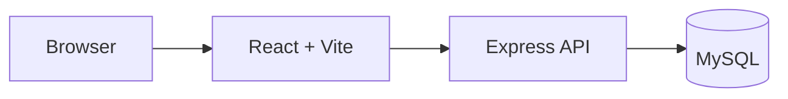
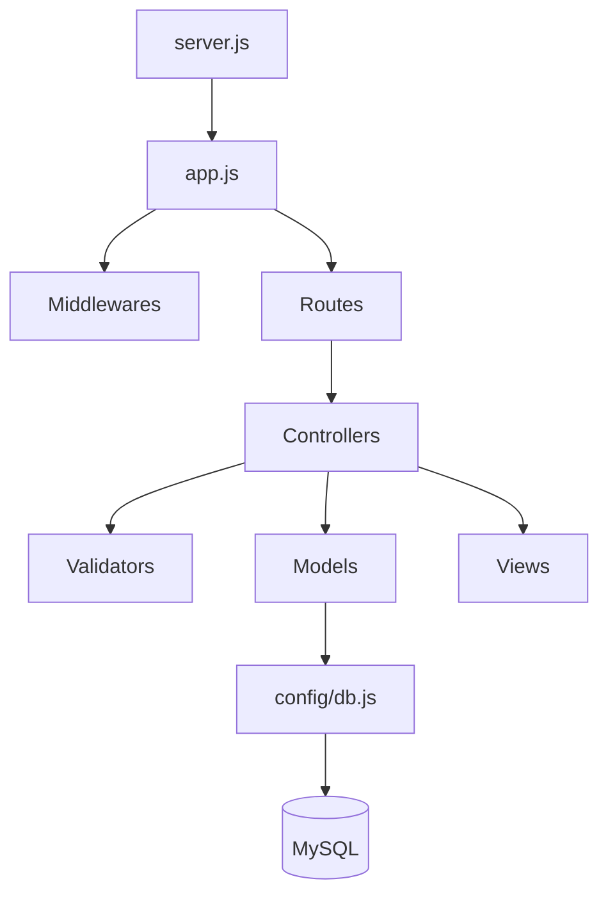
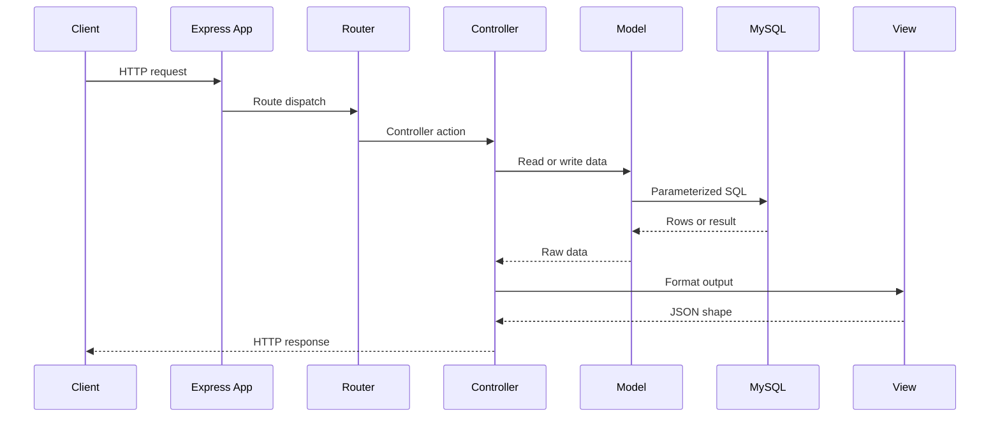
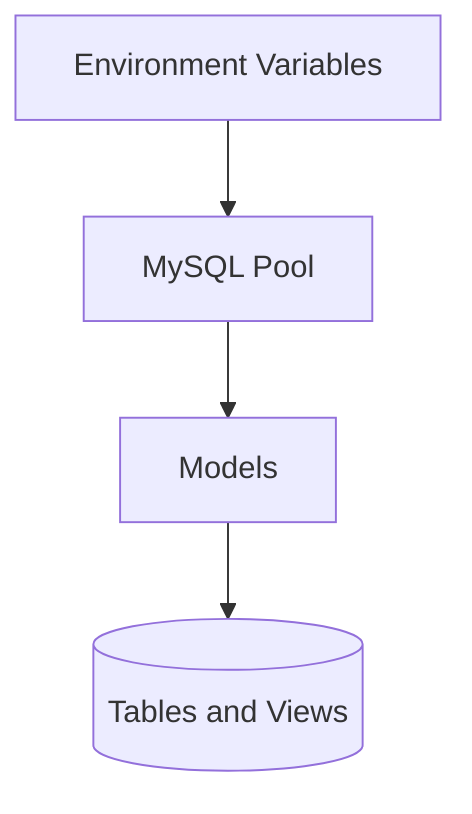
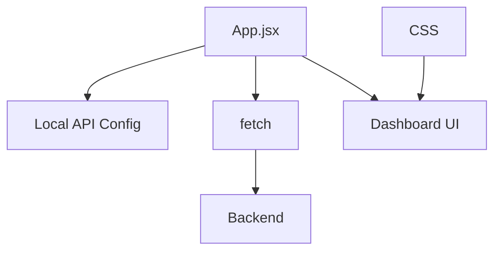

# 1. Architecture

## 1.1 Table of Contents

- [1. Architecture](#1-architecture)
  - [1.1 Table of Contents](#11-table-of-contents)
  - [1.2 Overview](#12-overview)
  - [1.3 Backend Layers](#13-backend-layers)
  - [1.4 Request Flow](#14-request-flow)
  - [1.5 Database Access](#15-database-access)
  - [1.6 Frontend](#16-frontend)
  - [1.7 Configuration](#17-configuration)

## 1.2 Overview

Chocolates App is split into a React frontend, an Express backend, and a MySQL database.

## 1.3 Backend Layers

| Layer | Responsibility |
| --- | --- |
| Server | Checks database connectivity and starts the app. |
| App | Configures Express, JSON parsing, CORS, logging, and error handling. |
| Routes | Connect HTTP modules to controllers. |
| Controllers | Coordinate validation, models, views, and responses. |
| Validators | Validate incoming write payloads. |
| Models | Run SQL queries through the MySQL pool. |
| Views | Shape database rows into frontend-friendly JSON. |

## 1.4 Request Flow

## 1.5 Database Access

The backend uses `mysql2` with a connection pool and `async/await`.

## 1.6 Frontend

The frontend uses React and Vite. `App.jsx` fetches backend data and renders empty states when no records are available.

## 1.7 Configuration

| Area | Configuration |
| --- | --- |
| Backend database | `DB_HOST`, `DB_USER`, `DB_PASSWORD`, `DB_NAME`, `DB_PORT` |
| Backend port | `APP_PORT`, then `PORT`, then default `3000` |
| Frontend API base | `VITE_API_BASE_URL` |
